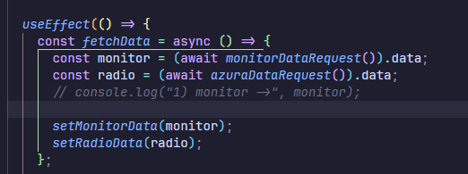

# Estructura del proyecto.

El proyecto esta dividido en dos secciones, el **frontend** encargado
de la parte visual el cual esta ubicado en la carpeta _client_ y
el **backend** que es la carpeta raiz de este proyecto.

- Puerto backend: 3000 (express)
- Puerto frontend: 5173 (Vite)

Todos los archivos del servidor se encuentran dentro de la carpeta src.

> .env: son las variables de configuración para la aplicación, contienen texto plano "string" donde se guarda las configuraciones de los puertos, claves API y URL's

En este archivo se encuentra

- Puerto : 3000 por defecto
- datos de acceso para API ACR Cloud
- link de la API y streaming de AzuraCast

> si se quiere modificar el puerto del backend, solamente modificar la varible PORT en el archivo.env

Desde el archivo **index.js** se levanta la ejecución de todo el servidor. Para poder habilitar el codigo de
**acrcloud_monitor.js** se debe descomentar la linea donde se esta importando.

Se encuentra comentado para no hacer uso de ella, ya que el servicio tiene un limite diario de peticiones que se
pueden realizar, por motivos de pruebas tecnicas se hace esto para no consumir todas las peticiones del servicio.

El archivo **app.js** es donde establece el uso de las rutas y permisos del servidor, haciendo uso de express
permite definir las rutas de la API:

cors es un middleware que permite o restrige los recursos de un servidor entre dominios.
el dominio del frontend al estar utilizando Vite es _"http://localhost:5173"_ en su defecto
si se esta trabajando desde local. Para poder utilizar el servidor en el dominio de oceandigital
, esta comentado, siendo este *http://radiousbbog.tech*, habilitar el dominio al cual se
quiera utilizar para hacer pruebas, el primero solo funciona para ejecutarse en local y realizar pruebas.

> Nota: Puede que el segundo dominio le falte el puerto. Vite utiliza por defecto el puerto 5173, por lo que seria probar si funciona con http://radiousbbog.tech:5173

## Rutas de peticion de datos de API

Las rutas que se definen son las siguientes.

> http://localhost:3000/api/radio

# Ruta /api/radio

Esta recibe los datos de la api de radio de AzuraCast, con un servicio como **postman** podemos verificar
si las peticiones estan siendo recibidas de forma correcta. Adicionalmente haciendo uso de la libreria de
morgan, levantando el servidor ya sea: desde entorno de desarrollo **npm run dev** ó producción **npm start**
podemos ver desde la consola si las peticiones estan siendo realizadas con exito.

si la consola estan imprimiendo las peticiones HTTP quiere decir que nuestro servidor esta activo,
debemos verificar que en ambos recursos sea **200** tanto para **/api/radio** y **/api/data**. Lo cual garantiza
que los datos estan siendo recibidos por el frontend con exito. Un **304** solo indica que no se ha actualizado
pero el que debemos tener precaución es con el **404** que nos inidica que hubo un error.

Si estas trabajando desde local si consultas la ruta _http://localhost:3000/api/radio_ mediante petición **GET**
deberias obtener un JSON con la metadata de la radio de AzuraCast, *http://radiousbbog.tech:3000/api/radio* desde
el servidor de ocean digital.

Desde Postman podemos verificar si las peticiones estan siendo realizadas de forma correcta, **(nota: solo va a funcionar si el servidor esta activo)**

## En caso de presentar problemas.

Si desde postman verificamos que la petición es correcta y estamos recibiendo un JSON pero el servicio aun no comunica,
debemos considerar dos problemas. Para verificar que no hay comunicación en el servicio mirar el player del client, por defecto
las peticiones se realizan en React, toda la carpeta perteneciente al cliente **(Frontend)** es la carpeta _client_ aqui tambien hay un
archivo src donde en la carpeta api con dirección:

> client/src/api/monitorMetada.js

se encuentra las direcciones que el cliente realiza **Peticiones GET** al servidor para extraer los datos de las rutas HTTP del
backend especificadas anteriormente. Por motivo de pruebas se encuentran dos direcciones y una comentada:

la constante API_Data es la dirección del backend. Si se ejecuta en un entorno local es el http://localhost con el numero del puerto
predefinido para el backend, es decir el que mencionamos anteriormente, el puerto 3000. Para el servidor con el nuevo dominio es http://radiousbbog.tech. Para obtener los datos de los servicios se agrega /api que es la ruta de procesamiento de las rutas del backend.

> Nota: Aca tambien se puede verificar como el nuevo dominio le falta agregar la extension del puerto, es decir el 3000, probar si funciona agregando el puerto, es decir -> http://radiousbbog.tech:3000/api"

La realización de las solicitudes al backend las realiza el cliente en la siguiente dirección

> client/src/context/radioContext.jsx

mediante axios se realiza las peticiones get a ambas rutas: la api/radio para los datos de azuraCast y la api/data para los datos obtenidos del codigo de acrcloud_monitor.js del backend el cual se encuentra ubicado en la carpeta scripts.

en la constante **radio** se guarda el JSON de lo obtenido de la radio de AzuraCast y el **monitor** lo que procesa y envia el archivo
de acr_cloudmonitor.js, por default envia un null si el proceso en acr_cloudmonitor.js no fue exitoso o no se ha procesado nada aun.

Se realiza un contexto en React para que estos datos puedas ser consultados en todos los componentes sin necesidad de realizar peticiones GET en cada uno de ellos. En el archivo de radioContext se define un intervalo de 10 Segundos, es decir por cada 10 segundos hace una peticion GET al backend para obtener los archivos JSON de los datos. Esto lo podemos visualizar en la consola de backend. Con morgan podemos ver esta información que es la que aparece y nos permite identificar si la petición fue correcta o si hubo problemas mediante la
estructura del codigo mencionada anteriormente, un 200 si fue exitosa y un 404 si ocurrieron problemas.

Puede que /api/data este enviado datos de forma exitosa sin estar ejecutando el codigo de acr_cloudmonitor.js, es decir, donde esta comentada la linea en el index.js del backend. Esto se debe a que por default esta enviando un null. Esto se puede mejorar en futuras versiones.

## ¿Como verificar que los datos no se procesaron correctamente?

Verificar el player. Por defecto este componente muestra los datos con una informacion pre establecida si detecta un null en la peticion GET, es decir de la variable **radio** definida anteriomente en radioContext.jsx. Si visualizamos esto, significa que recibio un null,
por tanto debemos verificar si los datos son correctos en la consola del backend y adicionalemente revisar si el JSON que recibe no es un null.

Si aparece como en la imagen anteriormente debemos revisar:

1. Problemas entre la comunicación entre el dominio de Vite **"http://localhost:5173"** (frontend) y el **http://localhost:3000** (backend) esto en dado caso de ser ejecutado desde local, si es desde el servidor seria reemplazar el dominio por **http://radiousbbog.tech**. Quiere decir que CORS esta impidiendo la comunicación entre ambos dominios, esto se debe modificar modificando el archivo
   app.js mencionado anteriormente con el dominio correcto, el cual es el del frontend (Vite).

Los archivos que se deben modificar son:

> client/src/api/monitorMetadata.js -> establecer la ruta correcta de peticiones GET al backend.

> src/app.js -> establecer la ruta correcta de comunicacion con el frontend.

recordar que los puertos por defecto son, **backend:3000** y **frontend:5173** por Vite.

Esto puede ser por que ambos dominios no se pueden comunicar, el error se puede presentar como el siguiente.

> Access to XMLHttpRequest at ..... from origin ..... has been blocked by CORS policy: The "Access-Control-Allow-Origin" header has a value ..... that not equal to the supplied origin.

Una vez solucionado esto se deberia poder visualizar las canciones, y el contenido en el player de la radio.

2. Si el problema persiste verificar que las peticiones que realiza el frontend el dominio sea el correcto. Este dominio es el del servidor backend, el del puerto 3000 en su defecto.

3. El archivo acr*cloudmonitor.js tambien tiene dos constantes que estan definidas si se
   esta desarrollando en local o en el servidor, esto es mas con respecto a la informacion que se
   recibe de /api/data, es decir la informacion que procesa el codigo que identifica si es de Google Speech to Text ó de ACR Cloud. Modificar según si se esta trabajando en local o en producción, \_Esto no tiene relacion con el player, ni la información que se ve en el reproductor de la pagina, pero si con el procesamiento de los datos de recomendación e informacion de la metadata del artista consultado.*

> src/scripts/arccloud_monitor.js

en general:

- **api/radio:** Información del player y reproducción de la radio en linea.
- **api/data:** Información que se extrae de acr_monitor.js para la metadata del artista y el servicio de Google Speech To Text.

## ¿Que archivos contienen las rutas a modificar.

Todos los archivos que inlcuyen rutas de comunicación Http son:

> client/src/api/monitorMetadata.js

> src/app.js ->

> src/scripts/arccloud_monitor.js
